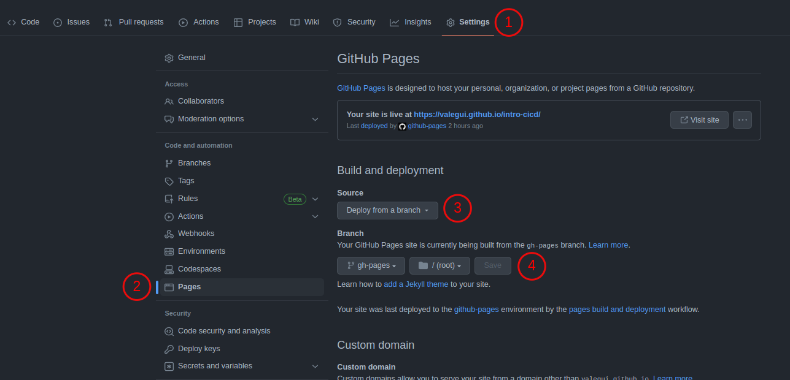

Integracion Continua y Entrega Continua (CI/CD)
===============================================

* CI es integrar contantemente el cambio en el codigo, usando scripts para builds y pruebas sobre 
  los cambios.

* CD es la practica de crear y desplegar codigo, generalmente en un ambiente de prueba, asi se 
  puede pasar a produccion en cualquier momento.

Se puede hacer despliegue cada vez que se integra, o se puede tener CI haciendo tests en otras ramas
y pull_requests, y al hacer el merge a master comienza CD.

GitHub Actions
==============
Permite tratar pipeline CI como codigo. Solo se necesita un archivo .yaml para la definicion del 
workflow en un directorio llamado '.github/workflows'.

No importa el nombre que se le de a los archivos porque cada archivo describe cuando se debe 
ejecutar. El "cuando" es el evento que debe ocurrir para ejecutar el job.

Una gran ventaja de GitHub Actions sobre otras herramientas CI como Circle CI, Travis CI y Jenkins, 
es que basta con crear el directorio de workflows y agregar los .yaml, no es necesario configurar el 
workflow en una pagina externa.

Conceptos
^^^^^^^^^

Un Workflow es una series de procesos automaticos que se ejecutan por GitHub Actions. En un 
repositorio pueden haber multiples workflows (ej: 1 para CI, 1 para CD, 1 para Seguridad). Cada 
workflow se compone de:

.. graphviz::

    digraph conceptos {

       "Event" [shape=box]
       "Jobs" [shape=box]
       "Runner" [shape=ellipse]
       "Steps" [shape=box]
       "Actions" [shape=box]

       { rank=same "Event" "Jobs" "Runner" "Steps" "Actions"}

       "Event" -> "Jobs" -> "Runner" -> "Steps" -> "Actions";
   }

* Event
   Evento que dice cuando debe ejecutarse un workflow, por ejemplo push, pull_request, release, fork, 
   delete. 
   Ver `GitHub Actions Events <https://docs.github.com/en/actions/using-workflows/events-that-trigger-workflows>`_.
* Jobs
   Es un conjunto de pasos en un workflow que se ejecutan en un mismo 'Runner'. En un workflow hay 1 
   o mas 'Jobs'. Cada 'Job' puede contener 1 o mas 'Steps'. Por defecto los 'Jobs' se ejecutan en 
   paralelo, menos cuando se especifica dependencia (con la keyword 'needs').
* Runner
   Servidor donde se ejecutan los 'Jobs'.
* Steps
   Es un conjunto de shell commands o acciones. Aquellos que son parte de un mismo 'Job' se ejecutan 
   en el mimsmo 'Runner', por lo que pueden compartir informacion entre ellos. Los pasos se ejecutan
   en orden y se puede tener un paso para compilar, otro para aplicar formato, otro para los tests, 
   otro que crea un contenedor de Docker.
* Actions
   Es el nivel mas bajo en un workflow. Ejecutan una sola tarea.

Configurar
^^^^^^^^^^

.. code-block:: yaml

   name: Example workflow

   on: # Para indicar el evento
     push:
       branches: ['master']

   jobs:
     build: # Nombre del Job
       runs-on: ubuntu-latest # Indica runner
       steps: # Especifica pasos que se ejecutan en orden
         - name: checkout
           uses: actions/checkout@v3
         - name: Install dependencies
           run: |
             python -m pip install --upgrade pip
             pip install -r requirements.txt
         - name: Python Black Check
           uses: rodrigogiraoserrao/python-black-check@v2.0
           with:
             line-length: '88'
             exclude: '/(\.git|\.hg|\.mypy_cache|\.pytest_cache|\.tox|\.venv|_build|build|dist)/'

Referencia entre workflows
^^^^^^^^^^^^^^^^^^^^^^^^^^

.. code-block:: yaml

  name: Dependent workflow

  on:
    workflow_run:
      workflows: ['Example workflow']
      branches: ['master']
      types:
        - completed

Si se especifican multiples workflows, solo uno necesita lograr el estado indicado en `types`. Si se 
necesita que el workflow que llego al estado indicado, lo haya hecho con exito, es necesario 
controlar el estado en el job.

.. code-block:: yaml

  jobs:
  on-success:
    runs-on: ubuntu-latest
    if: ${{ github.event.workflow_run.conclusion == 'success' }}
    steps:
      - run: echo 'The triggering workflow passed'
  on-failure:
    runs-on: ubuntu-latest
    if: ${{ github.event.workflow_run.conclusion == 'failure' }}
    steps:
      - run: echo 'The triggering workflow failed'

GitHub Pages
------------

.. code-block:: yaml

  name: GitHub Pages

  on:
    push:
      branches: [ "main"]

  permissions:
      contents: write

  jobs:
    deploy:
      runs-on: ubuntu-latest
      permissions:
        contents: write
      steps:
        - name: Checkout
          uses: actions/checkout@v3
        - name: Install dependencies
          run: |
            python -m pip install --upgrade pip
            pip install -r requirements.txt
        - name: Setup Graphviz
          uses: ts-graphviz/setup-graphviz@v1
          with:
            ubuntu-skip-apt-update: true
        - name: Sphinx build
          run: |
            sphinx-build -b html docs/source/ docs/build/html
        - name: Deploy
          uses: peaceiris/actions-gh-pages@v3
          if: ${{ github.ref == 'refs/heads/main' }}
          with:
            github_token: ${{ secrets.GITHUB_TOKEN }}
            publish_dir: docs/build/html
            force_orphan: true

Runner propio
-------------

Un self-hosted runner se puede agregar a un repositorio, una organizacion o una empresa. Como 
ejemplo, para agregar un runner a un repositorio se va a Settings/Actions/Runners.
Alli estaran las instrucciones para instalar la aplicacion de GitHub Actions para configurar un 
servidor como Runner. Tambien se indica como agregarlo al workflow. Todos los Runners propios tienen
labels que permiten seleccionarlo en el .yaml.

.. code-block:: yaml

  runs-on: [self-hosted, linux, ARM64]

Costos
^^^^^^

.. list-table::
   :header-rows: 1

   * - Product
     - Storage
     - Minutes (per month)
   * - GitHub Free
     - 500 MB
     - 2,000
   * - GitHub Pro
     - 1 GB
     - 3,000
   * - GitHub Free for organizations
     - 500 MB
     - 2,000
   * - GitHub Team
     - 2 GB
     - 3,000
   * - GitHub Enterprise Cloud
     - 50 GB
     - 50,000

Para mas detalles de costos y tiempos, ver 
`About billing for GitHub Actions <https://docs.github.com/en/billing/managing-billing-for-github-actions/about-billing-for-github-actions>`_.

Diferencia con GitLab CI/CI
^^^^^^^^^^^^^^^^^^^^^^^^^^^
GitLab CI se define en un archivo .gitlab-ci.yaml
En gitlab se define un pipeline. Un pipeline se compone de Jobs independientes que ejecutan 
scripts. Cada Job se es parte de un Stage. La ejecucion de stages es secuencial, y la ejecucion de 
jobs en un stage es en paralelo.

.. graphviz::

    digraph conceptosgitlab {

       "Pipeline" [shape=box]
       "Stage" [shape=box]
       "Jobs" [shape=ellipse]
       "Script" [shape=box]

       { rank=same "Pipeline" "Stage" "Jobs" "Script"}

       "Pipeline" -> "Stage" -> "Jobs" -> "Script";
   }

El orden de lo items en `stages` define el orden de ejecucion.

.. code-block:: yaml

  stages:          # List of stages for jobs, and their order of execution
    - build
    - test
    - deploy

  build-job:       # This job runs in the build stage, which runs first.
    stage: build
    script:
      - echo "Compiling the code..."
      - echo "Compile complete."

  unit-test-job:   # This job runs in the test stage.
    stage: test    # It only starts when the job in the build stage completes successfully.
    script:
      - echo "Running unit tests... This will take about 60 seconds."
      - sleep 60
      - echo "Code coverage is 90%"

  lint-test-job:   # This job also runs in the test stage.
    stage: test    # It can run at the same time as unit-test-job (in parallel).
    script:
      - echo "Linting code... This will take about 10 seconds."
      - sleep 10
      - echo "No lint issues found."

  deploy-job:      # This job runs in the deploy stage.
    stage: deploy  # It only runs when *both* jobs in the test stage complete successfully.
    environment: production
    script:
      - echo "Deploying application..."
      - echo "Application successfully deployed."

Tekton
======
Tekton es un framework open source para crear pipelines CI/CD. Se tiene control total de la secuencia 
de ejecucion, y se pueden ejecutar trabajos en serie o en parelelo. Funciona en cualquier lugar donde
se pueda ejecutar un cluster de Kubernetes.

Puede crear rápidamente sistemas de CI/CD que sean escalables, serverless y cloud native. Tekton se 
ejecuta de forma nativa en un cluster de Kubernetes, lo que elimina la necesidad de una solución de 
CI/CD independiente.

Conceptos
^^^^^^^^^
.. graphviz::

    digraph conceptostekton {

       "Event" [shape=box]
       "Trigger" [shape=box]
       "Pipeline" [shape=box]
       "Task" [shape=box]
       "Steps" [shape=box]

       { rank=same "Event" "Trigger" "Pipeline" "Task" "Steps"}

       "Event" -> "Trigger" -> "Pipeline" -> "Task" -> "Steps";
   }

* Event
   Evento externo que dice cuando debe 'dispararse un trigger', por ejemplo push, pull_request.
* Trigger
   El estimulo que comienza un 'pipeline run'.
* Pipeline
   Es un conjunto de tareas a ejecutar. No hay cantidad limite de tareas que se puede tener en un 
   pipeline y pueden ejecutarse en paralelo o en serie. Por defecto se ejecutan en paralelo, para la 
   ejecucion en serie se deben indicar dependencias.
* Task
   Es la unidad que comprende uno o mas pasos. En una 'Task' se pueden definir parametros que seran 
   entregados a los trabajos, tambien se pueden especificar el workspace necesario para almacenar 
   artefactos.
* Steps
   Son los comandos ejecutados para llevar a cabo las 'Tasks'. Generalmente son shell scripts que 
   ejecutan comandos para build, test y deploy de aplicaciones. Se ejecutan en la secuencia indicada.

Conceptos en concreto
^^^^^^^^^^^^^^^^^^^^^

.. image:: _static/tektonflow.png

Tekton funciona con Kubernetes CRD, en orden de ejecucion los CRD son los siguentes:

* EventListener: 
   Un CRD que escucha por eventos de un repositorio.
* TriggerBinding
   Captura datos del evento y se lo asigna o vincula a las propiedades en el pipeline.
* TriggerTemplate
   Toma los parametros de de TriggerBinding y los asocia con PipelineRun.
* PipelineRun
   Cuando se gatilla por un evento, TiggerTemplate crea un PipelineRun, pasando los parametros del 
   evento necesarios para la ejecucion. Un PipelineRun se puede crear manualmente, sin usar eventos.
   PipelineRun es lo que crea una pipeline.  Es responsable de las tareas, para eso crea un TaskRun 
   para cada tarea.
* TaskRun
   Crea un pod Kubernetes para que en el se ejecute la tarea. Todos los pasos de una tarea se 
   ejecutan en el mismo pod. Se crea un contenedor para cada paso.
* PersistentVolumeClaim
   Almacenamiento para artefactos que pueden ser compartidos en la pipeline. Por esto se puede hacer 
   check-out en una tarea, correr unit tesk en otra, linting en otra, crear una imagen en otra, etc.

.. note:: 
   
   Todo en Tekton es nativo de Kubernetes. Todo se ejecuta en un cluster de Kubernetes sin 
   necesidad de servidores CI/CD externos.

Configurar
^^^^^^^^^^

Definir Tasks y Steps
---------------------

Un archivo de especificacion de una tarea se define de la siguiente manera:

Para cada step se debe especificar una imagen sobre la cual se ejecutara.

.. code-block:: yaml

   apiVersion: tekton.dev/v1beta1
   kind: Task
   metadata:
     name: checkout
   spec:
     params:
       - name: repo-url
         description: Repo URL
         type: string
     steps:
       - name: checkout
         image: bitname/git:latest
         command: [git]
         args: ["clone", "$(params.repo-url)"]

Un ejemplo de checkout task.

Definir Pipeline
----------------

.. code-block:: yaml

   apiVersion: tekton.dev/v1beta1
   kind: Pipeline
   metadata:
     name: pipeline
   spec:
     params:
       - name: repo-url
     tasks:
       - name: clone
         taskRef:
           name: checkout
         params:
         - name: repo-url
           value: "$(params.repo-url)"

Ejecutar Pipeline 
-----------------

El segundo valor ``pipeline`` es el nombre de pipeline especificado en el archivo.
El parametro ``-p`` es para pasar los parametros que se especifican en el archivo de pipeline.

.. code-block:: console

   $ kubectl apply -f tasks.yaml
   $ kubectl apply -f pipeline.yaml
   $ tkn pipeline start pipeline --showlog -p repo-url="https://github.com/..."

Definir Triggers
----------------
Usan EventListener, TriggerBinding y TriggerTemplate.

.. code-block:: yaml

   apiVersion: triggers.tekton.dev/
   kind: EventListener
   metadata:
     name: cd-listener
   spec:
     serviceAccountName: pipeline
     triggers:
       - binding:
           name: cd-binding
         template:
           name: cd-template  

.. code-block:: yaml

   apiVersion: triggers.tekton.dev/
   kind: TriggerBinding
   metadata:
     name: cd-binding # Igual al nombre en EventListener
   spec:
     params:
       - name: repository
         value: "$(body.repository.url)"
       - name: branch
         value: "$(body.ref)"

.. code-block:: yaml

   apiVersion: triggers.tekton.dev/
   kind: TriggerTemplate
   metadata:
     name: cd-template # Igual al nombre en EventListener
   spec:
     params:
       - name: repository
         description: GIT repo URL
         default: ""
       - name: branch
         description: Branch to process
         default: "master"
     resoursetemplates: # Contiene un recurso PipelineRun
     - apiVersion: tekton.dev/v1beta1
       kind: PipelineRun
       metadata: 
         generateName: cd-pipeline-run # con generateName se especifica un id unico
       spec:
         serviceAccountName: pipeline # service account que corre la pipeline
         pipelineRef: # referencia a la pipeline que se quiere correr
           name: cd-pipeline # asumiendo que hay una pipeline llamada asi
         params: # parametros que cd-pipeline indico recibir en params
           - name: repo-url # nombre que la cd-pipeline especifica
             value: $(tt.params.repository) # este viene de la seccion params de TriggerTemplate
           - name: branch
             value: $(tt.params.branch)

Tekton en AWS
^^^^^^^^^^^^^